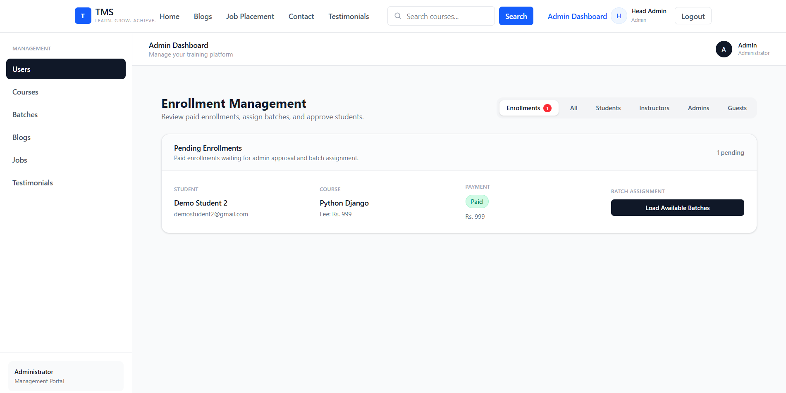
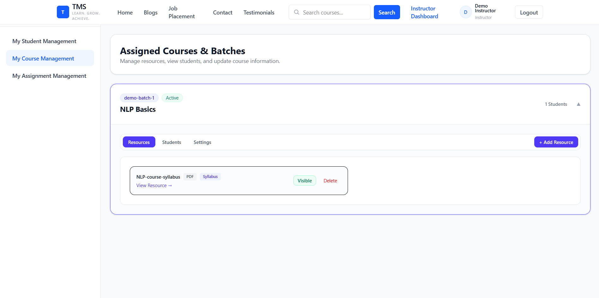
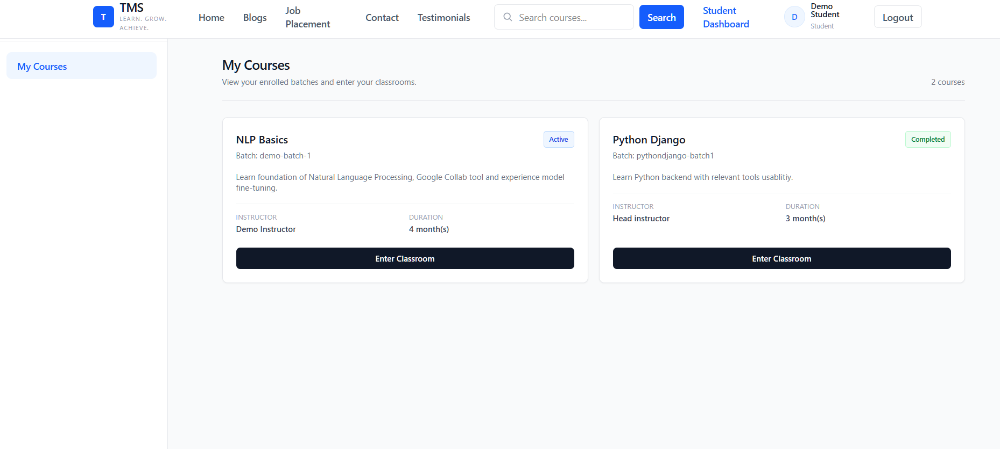
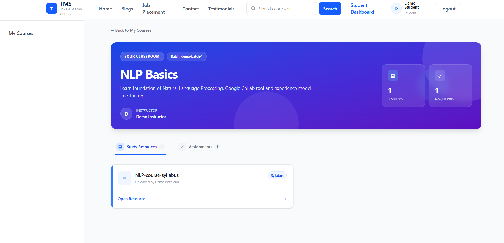

# Training Management System

A full-stack web application for managing training programs, batches, assignments, blogs and job vacancies with authentication and role-based access control.

**Roles:** Admin, Instructor, Student

**Live Demo:** https://vite-project-seven-tawny.vercel.app/

## Demo Credentials

| Role       | Email                       | Password   |
| ---------- | --------------------------- | ---------- |
| Student    | `demo.student@gmail.com`    | `demo.123` |
| Instructor | `demo.instructor@gmail.com` | `demo.123` |

> Admin access is not provided through the public demo account yet.

## Features

* 🔐 JWT authentication with HTTP-only cookies
* 👥 Role-based access control (RBAC)
* 📧 Email-based user onboarding with Resend
* ☁️ Cloudinary-based file storage
* 🎓 Training & batch management
* 📝 Assignment management
* 📰 Blog management
* 💼 Job vacancy management

## Tech Stack

**Frontend:** React, Axios, React Router
**Backend:** Node.js, Express.js
**Database:** MongoDB, Mongoose
**Authentication:** JWT, bcrypt, HTTP-only cookies
**Email:** Resend
**File Storage:** Cloudinary
**Deployment:** Vercel, Render, MongoDB Atlas

## Architecture

```text
  React
     ↓
Express REST API
     ↓
 Authentication & RBAC
     ↓
  MongoDB
  ↙       ↘
Resend   Cloudinary
```

## Screenshots

### Admin Dashboard



### Instructor Dashboard



### Student Dashboard



